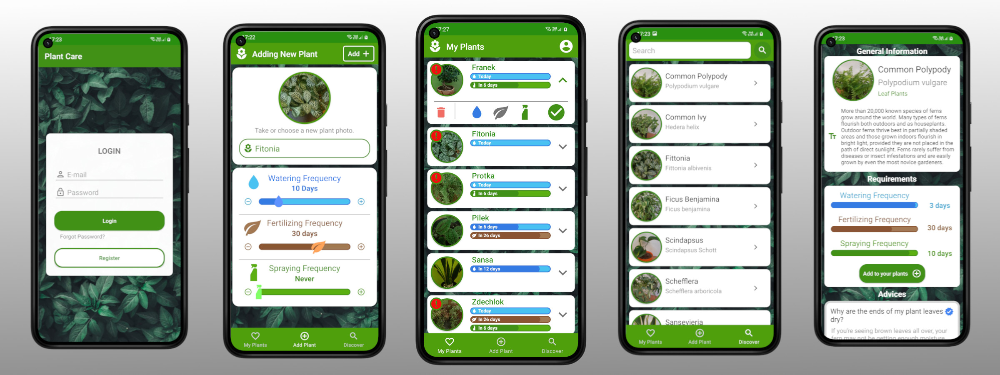

# Plant-Care-App
An android application for controlling and reminding about plants needs to the user.
Also, the application makes it possible to search through plants in the database or search for information and advice about them.
To remind users from outside the app about their plants, notifications with calculated time are implemented to notify at the right time. 
The application is implemented with FirebaseAuth to manage users accounts and Firebase Realtime Database to store data about plants also Firebase Storage to keep all plants photos.
The implementation of the MVP architectural pattern helps to maintain clean code.

## Status
The application is fully functioning and can be installed on the devices.

## Features
* Create and login to the account.
* Keep plants on your account.
* Browse and search through plants.
* Check information about plants.
* Control your plant's needs.
* Get notifications about your plants.
### TODO:
* Expand plant's needs to new data.
* Add image compression to shorten uploading time.

## Technologies
Application was created with:

### To work with Firebase:
* Firebase Database: 20.0.3 - to work with Firebase Database.
* Firebase Auth: 21:0.1 - to manage users accounts.
* Firebase Storage: 20.0.0 - to store plants photos.
* Firebase UI Storage: 6.2.1 - to work with Firebase Storage.
### To work with images:
* Glide: 4.8.0 - to simplify images usage.

## Architecture
To keep maintainability and code scalability application was implemented with a classic MVP architectural pattern. Additionally, there was implemented two additional layers: 
* Interactors to separate Presenters logic from network queries.
* Listeners to work with queries results.

## Instalation
Plant Care app requires a minimum API level of 23.
